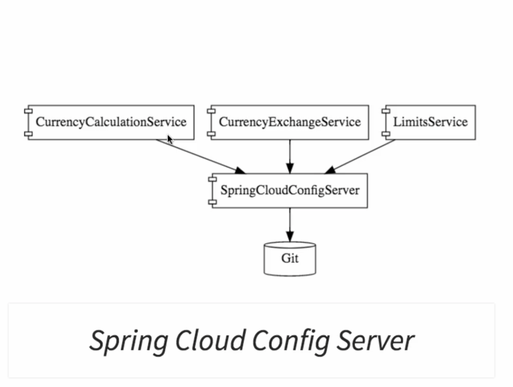

# Java Cloud Microservices

### 5 Challenges :

- **_Bounded Context :_** Comment nos services sont découpés.
- **_Configuration Management :_** Comment configurer les instances
- **_Dynamically Scale UP and Scale DOWN and destribute the load_**.
- **_Visibility :_** Une requete peut declancher plusieux MS, on veut savoir exactement lequel a fail et pourquoi, savoir lesquels sont UP et running.
- **_Pack of Cards :_** Eviter que si un service est down que toute notre architecture tombe à l'eau.

### Outils :

#### Spring Cloud Config Server

Nous permet de garder dans un et unique endroit les configurations de nos microservices (environement, variables, ..)

<div style="text-align:center">
    
</div>

### Eureka

- Service Registration
- Service Discovery

### Spring Cloud LoadBalancer

- Load Balancing entre les instances d'un service.

### Zipkin Distributed Tracing

- Permet de tracer une requete entre les differentes instances

### Spring Cloud Gateway

-

### Resilience4j

- Fault tolerance, definition de la reponse par defaut si un service est down.

### Axon Server

```
 docker run -d --name -p 8024:8024 -p 8124:8124 -v /Users/imadsalki/docker-data/axon-server/data:/data
 -v /Users/imadsalki/docker-data/axon-server/eventdata:/eventdata -v /Users/imadsalki/docker-data/axon-server/config:/config axoniq
/axonserver 
````

## Ports

| Application                       | Port                  |
| --------------------------------- | --------------------- |
| Netflix Eureka Naming Server      | 10000                 |
| Spring Cloud Config Server        | 10001                 |
| Spring Cloud Gateway Service      | 10002                 |
|                                   |                       |
| Authentication Service            | 8000, 8001, 8002, ..  |
| User Service                      | 8100, 8101, 8102, ... |


